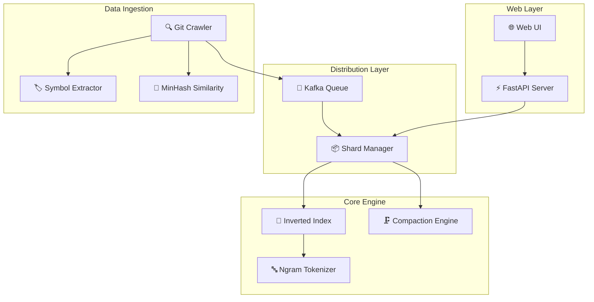
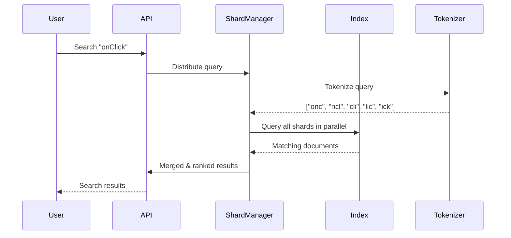

# 🐦‍⬛ Blackbird Search Engine

A high-performance code search engine inspired by [GitHub's Blackbird](https://github.blog/engineering/architecture-optimization/how-we-built-github-code-search/). Uses ngram-based indexing for lightning-fast substring matching across codebases.


## ✨ Features

- **Ngram-Based Search** - Trigram indexing enables fast substring matching (search for `onClick` finds all occurrences)
- **Symbol Extraction** - Prioritizes matches in function/class names for better relevance
- **8-Shard Distribution** - Parallel indexing and search for scalability
- **Delta Crawling** - Efficient updates using MinHash similarity between repositories
- **Compaction Engine** - Tiered merging of index segments for optimal performance
- **Modern Web UI** - Dark theme with glassmorphism design

## 🚀 Quick Start

### Prerequisites

- Python 3.11+
- Git

### Installation

```bash
# Clone the repository
git clone https://github.com/your-repo/blackbird.git
cd blackbird

# Create virtual environment
python -m venv venv

# Activate virtual environment
# Windows:
.\venv\Scripts\activate
# Linux/Mac:
source venv/bin/activate

# Install dependencies
pip install -r requirements.txt

# Install package in editable mode
pip install -e .
```

### Running the Server

```bash
# Start the server on port 8080
.\venv\Scripts\uvicorn blackbird.api.main:app --host 0.0.0.0 --port 8080

# Or with auto-reload for development
.\venv\Scripts\uvicorn blackbird.api.main:app --host 0.0.0.0 --port 8080 --reload
```

Then open **http://localhost:8080** in your browser.


## 📖 Usage Guide

### Using the Web Interface

1. **Search Code**: Enter a query in the search box (e.g., `async function`, `onClick`, `import React`)
2. **Filter by Language**: Use the dropdown to filter results by programming language
3. **Index Repositories**: Click "Index" tab to add repositories to the search index
4. **View Statistics**: Click "Stats" tab to see index statistics and shard details

### Using the REST API

#### Search Code
```bash
# Basic search
curl "http://localhost:8080/search?q=onClick"

# With filters
curl "http://localhost:8080/search?q=function&language=javascript&limit=20"
```

#### Index a Repository
```bash
# Index a local repository
curl -X POST http://localhost:8080/index/repo \
  -H "Content-Type: application/json" \
  -d '{"path": "C:\\path\\to\\your\\repo"}'

# Index with custom ID
curl -X POST http://localhost:8080/index/repo \
  -H "Content-Type: application/json" \
  -d '{"path": "/home/user/myproject", "repo_id": "my-project"}'
```

#### Check System Stats
```bash
curl http://localhost:8080/stats
```

#### Health Check
```bash
curl http://localhost:8080/health
```

### Using the CLI

```bash
# Index a repository
python -m blackbird index /path/to/repo

# Search from command line
python -m blackbird search "onClick" --limit 10

# View statistics
python -m blackbird stats
```

## 🏗️ Architecture



### Data Flow



## 📁 Project Structure

```
blackbird/
├── blackbird/
│   ├── api/                 # FastAPI routes and search service
│   │   ├── main.py         # Application entry point
│   │   ├── routes.py       # REST API endpoints
│   │   └── search.py       # Search service with result enrichment
│   ├── core/               # Core search engine
│   │   ├── ngram.py        # Trigram tokenizer
│   │   ├── document.py     # Code document representation
│   │   ├── index.py        # Inverted index with posting lists
│   │   └── compaction.py   # Segment compaction engine
│   ├── crawler/            # Repository crawlers
│   │   ├── git_crawler.py  # Git repository crawler
│   │   ├── symbol_extractor.py  # Function/class extraction
│   │   └── similarity.py   # MinHash similarity estimation
│   ├── kafka/              # In-memory event queue
│   │   ├── queue.py        # Partitioned message queue
│   │   ├── producer.py     # Event publisher
│   │   └── consumer.py     # Shard consumers
│   ├── shard/              # Distributed sharding
│   │   ├── manager.py      # Shard coordination
│   │   └── partition.py    # Consistent hashing
│   ├── tests/              # Unit tests
│   └── web/                # Frontend UI
│       ├── index.html
│       ├── styles.css
│       └── app.js
├── docs/                   # Documentation and screenshots
├── requirements.txt
├── setup.py
└── README.md
```

## 🔧 Configuration

Edit `blackbird/config.py` to customize:

```python
# Ngram settings
NGRAM_SIZE = 3              # Trigrams by default

# Sharding
NUM_SHARDS = 8              # Number of index shards

# Crawling
MAX_FILE_SIZE_MB = 1        # Skip files larger than this
SUPPORTED_EXTENSIONS = ['.py', '.js', '.ts', '.java', ...]
EXCLUDED_DIRS = ['node_modules', '.git', 'vendor', ...]

# API
API_HOST = "0.0.0.0"
API_PORT = 8000
```

## 🧪 Running Tests

```bash
# Run all tests
.\venv\Scripts\python -m pytest blackbird/tests/ -v

# Run with coverage
.\venv\Scripts\python -m pytest blackbird/tests/ --cov=blackbird
```

## 📊 How Ngram Search Works

1. **Indexing**: Code is tokenized into overlapping trigrams
   - `"limits"` → `["lim", "imi", "mit", "its"]`
   
2. **Searching**: Query is also tokenized, then we find documents containing ALL ngrams
   - Query `"mit"` matches any document containing that trigram
   
3. **Ranking**: Results scored by:
   - Number of matching ngrams
   - Symbol matches (function/class names) get higher scores
   - Position of matches in the file

## 🎯 API Reference

| Endpoint | Method | Description |
|----------|--------|-------------|
| `/health` | GET | Health check |
| `/stats` | GET | Index statistics |
| `/search` | GET | Search code (`?q=query&limit=20&language=python`) |
| `/search` | POST | Search with JSON body |
| `/index/repo` | POST | Index a repository |
| `/admin/compact` | POST | Trigger compaction |
| `/admin/save` | POST | Save index to disk |

## 📚 References

- [GitHub's Blackbird Architecture](https://github.blog/engineering/architecture-optimization/how-we-built-github-code-search/)
- [Ngram Indexing](https://nlp.stanford.edu/IR-book/html/htmledition/k-gram-indexes-for-wildcard-queries-1.html)
- [MinHash for Similarity](https://en.wikipedia.org/wiki/MinHash)

## 📄 License

MIT License
