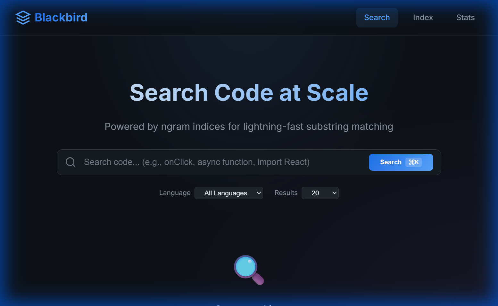
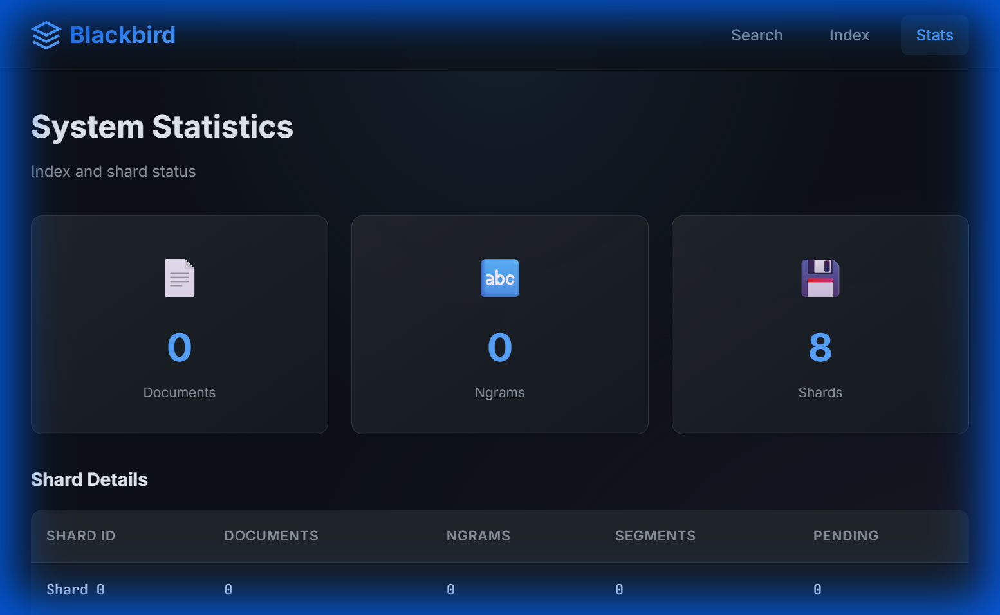
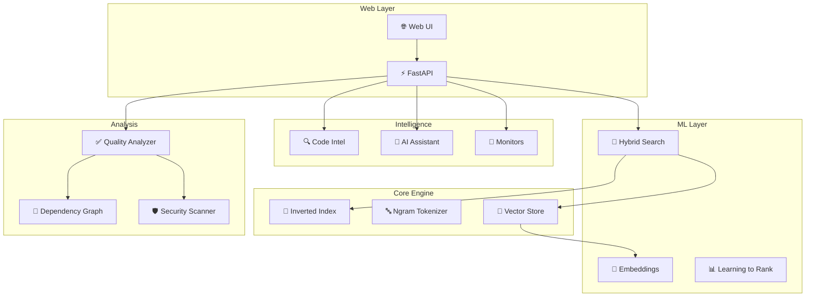

# 🐦‍⬛ Blackbird Search Engine for GitHub

A high-performance code search engine inspired by [GitHub's Blackbird](https://github.blog/engineering/architecture-optimization/how-we-built-github-code-search/) and [Sourcegraph](https://sourcegraph.com). Combines ngram-based indexing with ML-powered semantic search and code intelligence.



## ✨ Features

### Core Search
- **Ngram-Based Search** - Trigram indexing for lightning-fast substring matching
- **Semantic Search** - Neural embeddings with FAISS for meaning-based search
- **Hybrid Search** - Combines ngram + semantic with RRF fusion for best results
- **Structural Search** - AST pattern matching (Sourcegraph-style): `def :[name](:[args]):`

### Code Intelligence
- **Go-to-Definition** - Jump to symbol definitions across files
- **Find References** - Locate all usages of any symbol
- **Hover Information** - Rich tooltips with symbol details
- **Scope Analysis** - Context-aware symbol resolution

### AI-Powered
- **Natural Language Search** - Search code using plain English
- **Code Explanation** - AI explains what code does
- **Code Generation** - Generate code from descriptions
- **Code Review** - AI-powered review suggestions

### Analysis & Monitoring
- **Code Quality Scores** - Maintainability, complexity, security grades
- **Security Scanner** - Detects hardcoded secrets, SQL injection, eval() usage
- **Code Monitors** - Watch for patterns and trigger alerts (Sourcegraph-style)
- **Dependency Graphs** - Visualize import relationships

### Collaboration
- **Code Notebooks** - Interactive exploration with markdown, queries, and code cells
- **Learning to Rank** - ML-based result ranking that improves with usage
- **Personalized Search** - Results adapt to individual preferences

### Infrastructure
- **8-Shard Distribution** - Parallel indexing and search
- **Delta Crawling** - Efficient updates using MinHash similarity
- **Caching Layer** - LRU caches for embeddings and search results
- **Modern Web UI** - Dark theme with glassmorphism design

## 🚀 Quick Start

### Prerequisites
- Python 3.11+
- Git

### Installation

```bash
# Clone the repository
git clone https://github.com/thanhauco/blackbird.git
cd blackbird

# Create virtual environment
python -m venv venv

# Activate
# Windows:
.\venv\Scripts\activate
# Linux/Mac:
source venv/bin/activate

# Install dependencies
pip install -r requirements.txt

# Install package
pip install -e .
```

### Running the Server

```bash
# Start the server
uvicorn blackbird.api.main:app --host 0.0.0.0 --port 8080

# With auto-reload for development
uvicorn blackbird.api.main:app --port 8080 --reload
```

Open **http://localhost:8080** in your browser.



## 📖 Usage Guide

### Web Interface
1. **Search**: Enter query (supports `lang:python`, `file:*.js` filters)
2. **Index Repos**: Click "Index" tab to add repositories
3. **View Stats**: Click "Stats" tab for index statistics

### REST API

```bash
# Basic search
curl "http://localhost:8080/search?q=onClick"

# Semantic search
curl -X POST http://localhost:8080/v2/search/semantic \
  -H "Content-Type: application/json" \
  -d '{"query": "function that handles user login", "mode": "hybrid"}'

# Natural language search
curl -X POST http://localhost:8080/v2/search/natural \
  -H "Content-Type: application/json" \
  -d '{"query": "how to validate email addresses"}'

# Index a repository
curl -X POST http://localhost:8080/index/repo \
  -d '{"path": "/path/to/repo"}'

# Analyze code quality
curl -X POST http://localhost:8080/v2/analysis/quality \
  -d '{"file_path": "app.py", "content": "...", "language": "python"}'
```

### Structural Search (Sourcegraph-style)

```python
from blackbird.search import StructuralSearchEngine

engine = StructuralSearchEngine()

# Find all function definitions
results = engine.search("def :[name](:[args]):", code, "test.py", "python")

# Find try/except blocks
results = engine.search("try:\n...\nexcept :[exc]:", code)

# With captures
for match in results:
    print(f"Function: {match.captures.get('name')}")
```

### Code Monitors

```python
from blackbird.monitors import CodeMonitor, MonitorRule, AlertSeverity

monitor = CodeMonitor()

# Add custom rule
monitor.add_rule(MonitorRule(
    id="custom-001",
    name="Console.log detector",
    pattern=r"console\.log\(",
    severity=AlertSeverity.WARNING
))

# Scan code
alerts = monitor.scan("app.js", code, language="javascript")
```

### Code Notebooks

```python
from blackbird.notebooks import NotebookEngine, CellType

engine = NotebookEngine()
notebook = engine.create_notebook("API Investigation")

engine.add_cell(notebook.id, CellType.MARKDOWN, "# API Analysis")
engine.add_cell(notebook.id, CellType.QUERY, "lang:python def authenticate")
engine.add_cell(notebook.id, CellType.CODE, "print('hello')", "python")

# Export
markdown = engine.export_markdown(notebook.id)
```

## 🏗️ Architecture



## 📁 Project Structure

```
blackbird/
├── blackbird/
│   ├── api/                 # FastAPI routes
│   │   ├── routes.py       # Core REST endpoints
│   │   └── ml_routes.py    # ML feature endpoints
│   ├── core/               # Core search engine
│   │   ├── ngram.py        # Trigram tokenizer
│   │   ├── index.py        # Inverted index
│   │   └── compaction.py   # Segment compaction
│   ├── ml/                 # Machine learning
│   │   ├── embeddings.py   # Code embeddings + FAISS
│   │   ├── hybrid.py       # Hybrid search with RRF
│   │   ├── ranking.py      # Learning to rank
│   │   └── query.py        # Query expansion
│   ├── intelligence/       # Code intelligence
│   │   ├── code_intel.py   # Go-to-def, find-refs
│   │   └── scope.py        # Scope analysis
│   ├── ai/                 # AI assistant
│   │   ├── assistant.py    # LLM integration
│   │   └── prompts.py      # Prompt engineering
│   ├── analysis/           # Code analysis
│   │   ├── quality.py      # Quality metrics
│   │   ├── metrics.py      # Halstead, maintainability
│   │   └── dependencies.py # Import graph
│   ├── search/             # Advanced search
│   │   └── structural.py   # Structural pattern matching
│   ├── monitors/           # Code monitors
│   │   └── code_monitor.py # Pattern alerts
│   ├── notebooks/          # Code notebooks
│   │   └── notebook.py     # Interactive exploration
│   ├── cache/              # Caching
│   │   ├── cache.py        # LRU cache
│   │   └── prefetch.py     # Cache warming
│   ├── crawler/            # Repository crawlers
│   ├── kafka/              # Event queue
│   ├── shard/              # Distributed sharding
│   └── tests/              # Unit tests
├── docs/
├── requirements.txt
└── README.md
```

## 🎯 API Reference

### Core Endpoints
| Endpoint | Method | Description |
|----------|--------|-------------|
| `/health` | GET | Health check |
| `/stats` | GET | Index statistics |
| `/search` | GET | Ngram search |
| `/index/repo` | POST | Index a repository |

### ML Endpoints (v2)
| Endpoint | Method | Description |
|----------|--------|-------------|
| `/v2/search/semantic` | POST | Semantic/hybrid search |
| `/v2/search/natural` | POST | Natural language search |
| `/v2/intel/definition` | POST | Go to definition |
| `/v2/intel/references` | POST | Find references |
| `/v2/ai/explain` | POST | Explain code |
| `/v2/ai/generate` | POST | Generate code |
| `/v2/analysis/quality` | POST | Code quality analysis |
| `/v2/analysis/security` | POST | Security scan |

## 🧪 Running Tests

```bash
# Run all tests
pytest blackbird/tests/ -v

# With coverage
pytest blackbird/tests/ --cov=blackbird

# Run specific test file
pytest blackbird/tests/test_ml.py -v
```

## 📚 References

- [GitHub's Blackbird Architecture](https://github.blog/engineering/architecture-optimization/how-we-built-github-code-search/)
- [Sourcegraph Code Intelligence](https://sourcegraph.com/docs/code-intelligence)
- [Sentence Transformers](https://www.sbert.net/)
- [FAISS Vector Search](https://github.com/facebookresearch/faiss)

## 📄 License

MIT License
